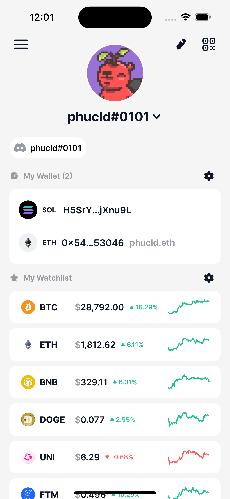
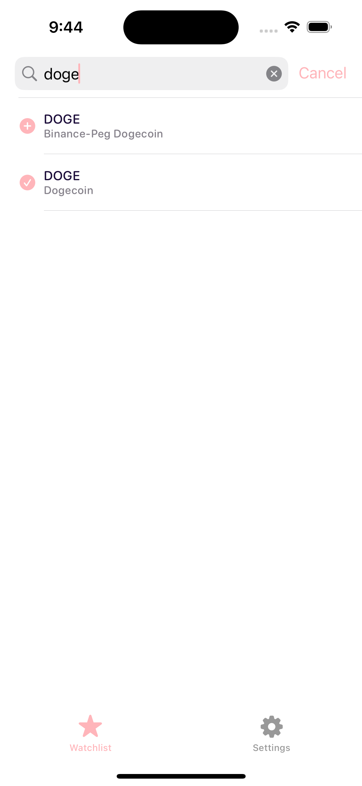
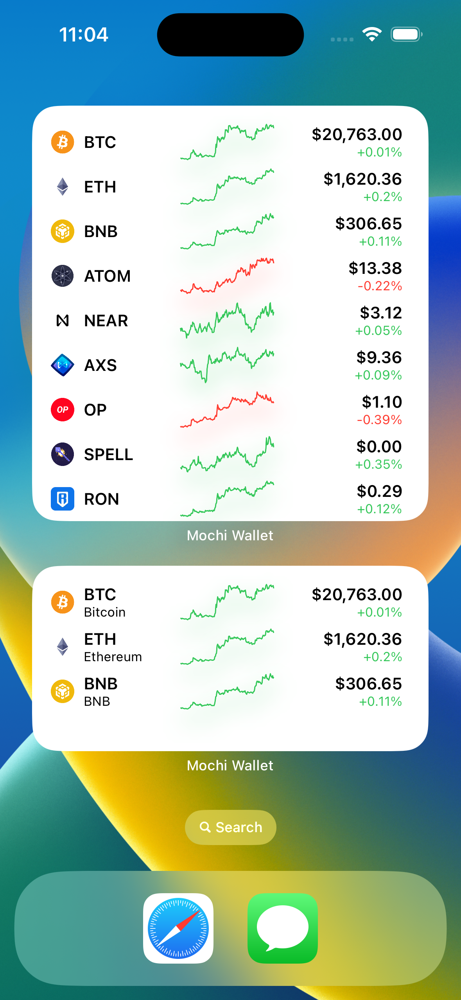
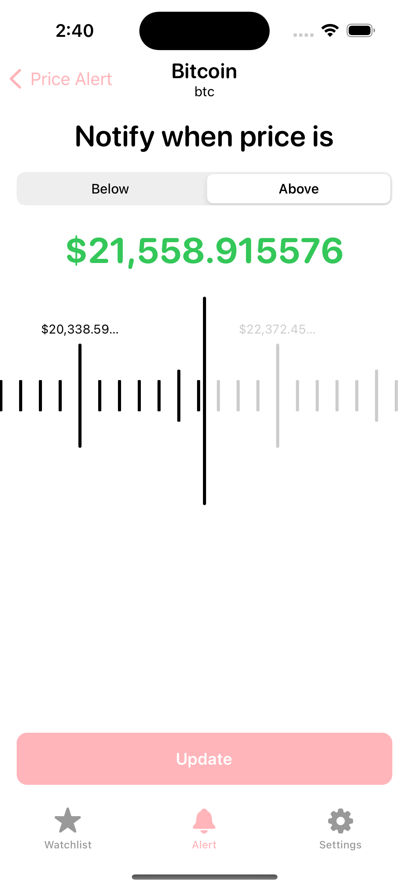
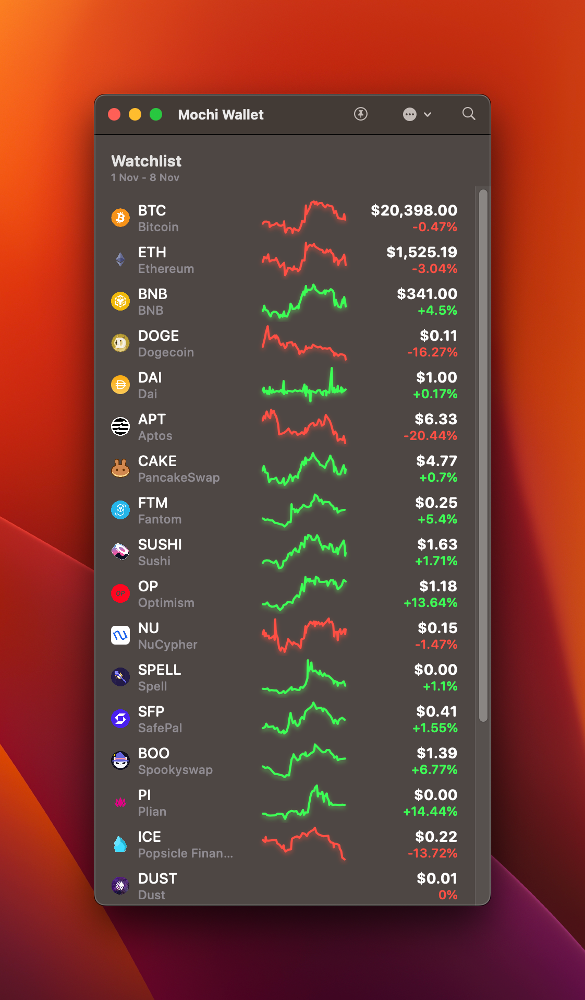
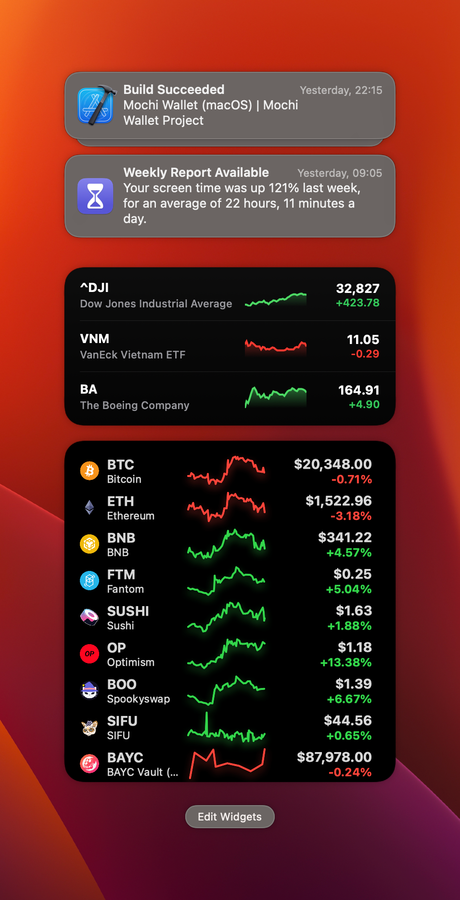
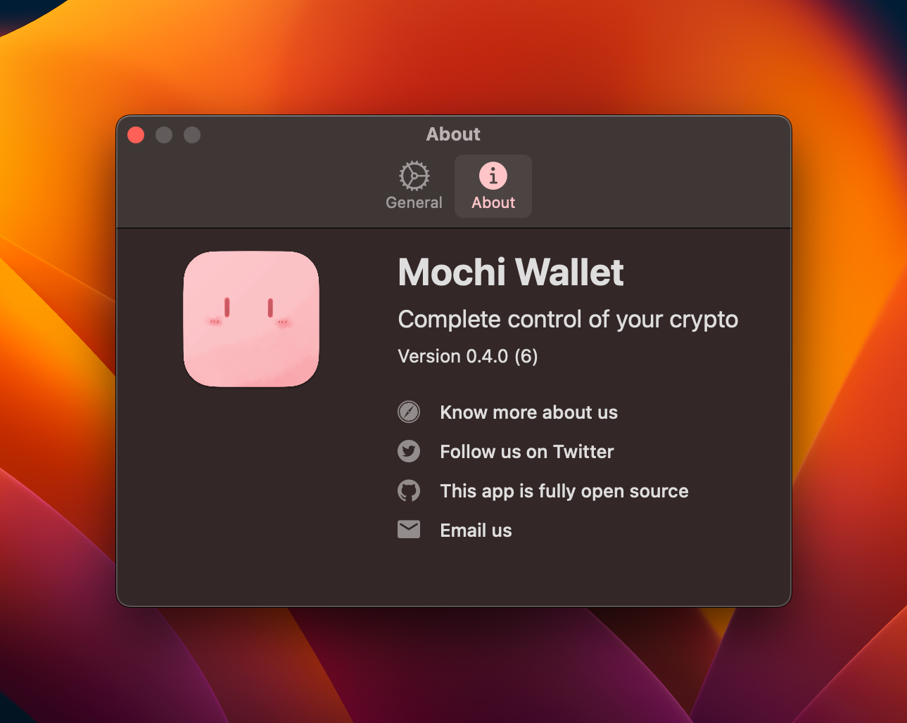

	

	
	

# Mochi Wallet

Mochi Wallet is a non-custody wallet, giving you complete control of your crypto 🤘

	
	
	
	

	
	
	

## License

MIT &copy; [Console Labs](https://github.com/consolelabs)
